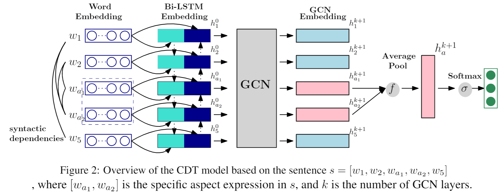

## Aspect-Level Sentiment Analysis Via Convolution over Dependency Tree

Dataset and code for the paper: **Aspect-Level Sentiment Analysis Via Convolution over Dependency Tree**. Kai Sun, [Richong Zhang](http://act.buaa.edu.cn/zhangrc/), Samuel Mensah, Yongyi Mao, Xudong Liu. EMNLP 2019. [[pdf]](graph_convolutional_networks_for_sentiment_analysis_.pdf)

## Overview

A dependency tree shortens the distance between the aspects and opinion words of a sentence, allowing neural network models to capture long-term syntactic dependencies effortlessly. Besides, dependency trees have graph-like structures bringing to play the recent class of neural networks, namely, graph convolutional networks (GCN). The GCN has been successful in learning representations for nodes, capturing the local position of nodes in the graph. These observations motivate us to develop a neural model which can operate on the dependency tree of a sentence, with the aim to make accurate sentiment predictions with respect to specific aspects. Specifically, a BiLSTM is first employed to capture the contexutual information for each word. Then the BiLSTM embeddings are enhanced by a multi-layer GCN over the dependency tree. The aspect-sepcific embeddings of the last GCN layer are extracted and used for final classification.



## Requirement

- Python 3.6.7
- PyTorch 1.2.0
- NumPy 1.17.2
- GloVe pre-trained word vectors:
  - Download pre-trained word vectors [here](https://github.com/stanfordnlp/GloVe#download-pre-trained-word-vectors).
  - Extract the [glove.840B.300d.zip](http://nlp.stanford.edu/data/wordvecs/glove.840B.300d.zip) to the `dataset/glove/` folder.

## Usage

Training the model:

```bash
python train.py --dataset [dataset]
```

Prepare vocabulary files for the dataset:

```bash
python prepare_vocab.py --dataset [dataset]
```

## Citation

If this work is helpful, please cite as:

```bibtex
@inproceedings{Sun2019CDT,
  author    = {Kai Sun and
               Richong Zhang and
               Samuel Mensah and
               Yongyi Mao and
               Xudong Liu},
  title     = {Aspect-Level Sentiment Analysis Via Convolution over Dependency Tree},
  booktitle = {Proceedings of the 2019 Conference on Empirical Methods in Natural
               Language Processing and the 9th International Joint Conference on
               Natural Language Processing, {EMNLP-IJCNLP} 2019, Hong Kong, China,
               November 3-7, 2019},
  pages     = {5678--5687},
  year      = {2019}
}
```

## License

MIT
